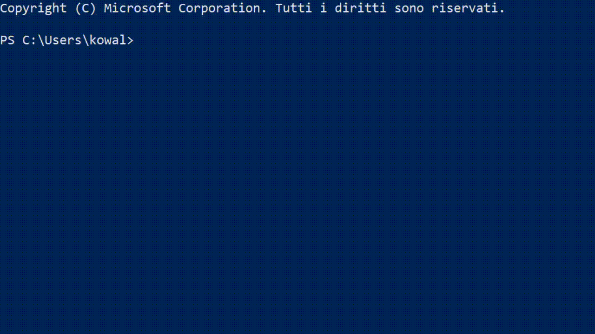
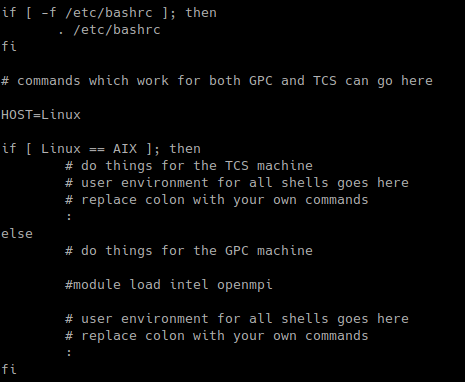
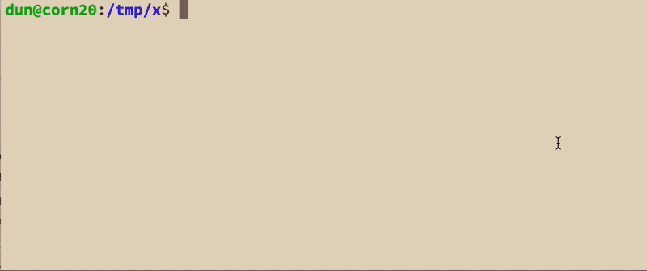

# Bash: dalle basi allo scripting (parte 1)


## Cos’ è la shell?


### Shell 
* LA SHELL NON E’ LINTERFACCIA A RIGA DI COMANDO
* L'interfaccia a riga di comando o cli è un tipo di interfaccia tra un qualunque dispositivo e l’ utente finale


### Shell 
* LA SHELL NON E’ IL TERMINALE
* Il terminale è un dispositivo per ricevere e trasmettere dati e può essere di tipo software (Terminale Virtuale) o hardware


### Shell 
* È un interprete di comandi
* È una delle parti principali di un OS, generalmente dell’ userspace
* Permette di lanciare comandi e programmi


### Shell 
* Esistono varie shell, tra le principali:
  * *Sh, Bourne Shell, la shell originale di UNIX*
  * *Zsh, Z shell*  (❤)
  * *Ksh, Korn Shell*
  * *Cmd.exe, la shell di NT*
  * *Windows PowerShell, una shell avanzata di Microsoft*
  * *Busybox, una shell compatta e usata per i sistemi embedded*
  * *Bash, Bourne Again Shell, la shell principale di GNU/Linux*





## Bash


### Bash
* Nasce nel 1988, la prima versione stabile è del 1989
* Fa parte del progetto GNU
* La sintassi di bash è un superinsieme di quella di sh
* E’ compatibile con tutti gli script per Sh (ma non vale il contrario)
* Non completamente POSIX-compliant di default.
Note:
Spiegare POSIX


### Bash
* Viene configurata attraverso script in particolare:
* `~/.bashrc` che viene eseguito quando è invocata in modo interattivo
* `~/.bash_profile` che viene eseguito quando è invocata come shell di login
* Sono opzionali la configurazione di default è in `/etc/bashrc`


### Bash


`~/.bashrc`


### Bash


`~/.bash_profile`


### Navigazione
* `Ctrl+A` va ad inizio riga
* `Ctrl+E` va a fine riga
* `Alt+B` o `Ctrl+freccia sx` va ad inizio parola
* `Alt+F` o `Ctrl+freccia dx` va a fine parola


### History
* Bash implementa la storia dei comandi digitati
* Usando freccia su e giù si naviga tra gli ultimi comandi


### Autocompletamento
* Bash supporta la funzione di autocompletamento
* Premendo `Tab` si completa il comando
* Da certi pacchetti viene abilitato autocompletamento per determinati comandi


## Le Basi


### Basi
* La cosa *_essenziale_* è saper come chiedere *_aiuto_*
* Ci sono diverse possibilità


## Man
```
man <comando>
```  
* Man è un tool per mostrare le man pages ovvero le pagine del manuale per un 
programma.
* Ogni pagina tratta nello specifico un singolo programma.
* _*Premere `Q` per uscire da man*_


## Info
```
info <comando>
```  
Info è un programma simile a man ma che presenta una struttura meglio organizzata
e collegata tra ogni pagina  
_*Premere `Q` per uscire da info*_


## Altre Opzioni
```
<comando> -h
``` 
oppure 
```
<comando> --help
```  
` -h ` e ` --h ` sono due opzioni molto comuni presenti in quasi ogni software, provare
sempre una delle due opzioni se non si sa bene come usare il comando e non si ha 
una pagina di __man__ a disposizione


## Struttura Comandi
La Struttura base è del tipo
```
<comando> OPZIONI ARGOMENTI
```  
Le opzioni possono essere di 4 tipi:
1. *Estese* del tipo `--opzione-estesa`
2. *Estese con parametri* del tipo `--opzione-estesa <parametro>`
3. *Brevi* del tipo `-o`
4. *Brevi con parametro* del tipo `-o <parametro>`


## Argomenti
* Gli argomenti sono generalmente di tipo posizionale
* Conta l' ordine in cui sono inseriti 


### Flussi di I/O


## Cosa sono
__Modi in cui si può far dialogare l' utente e il terminale__
Sono di 3 tipi:
* STDIN
* STDOUT
* STDERR


## STDIN
__Stream di Ingresso__  
Porta alle applicazioni e al sistema operativo i dati immessi 
dall’utente tramite una periferica di input ad esempio la tastiera


## STDOUT
__Stream di Uscita__  
Stampa a schermo i dati delle applicazioni


## STDERR
__Stream di Errore__  
Stampa a schermo gli errori


## Redirection
Il reindirizzamento permette di controllare dove va l'output di un comando
e da dove arriva l'input di un comando  



## Comandi per la redirection
```
> Redirezione di STDOUT
```
```
>> Appendere STDOUT alla destinazione
```
```
tee Copia STDOUT e lo redirige
```
```
< Redirezione di STDIN
```
``` 
<< Appendere STDIN alla destinazione
```
```
2> Redirezione di STDERR
```
```
&1 Puntatore a STDOUT
```
```
| redirige lo STDOUT della sorgente sull' STDIN della
  destinazione
```


## Esempi Reali
```
cat some_file.txt 2>/dev/null
```
Redirige l' STDERR del comando cat nel cestino
```
cat < some_file.txt
```
Redirige l'STDIN del file (il file stesso) al comando cat
```
ls -lAh | grep txt | tee lista.txt
```


## Piccole Note
L' operazione di redirezione può esser fatta in qualunque posizione del comando quindi:
```
cat foo.txt bar.txt >new.txt
```
```
cat >new.txt foo.txt bar.txt
```
```
>new.txt cat foo.txt bar.txt
```
Sono tutti equivalenti


## Filtri
* Sono una particolarità dei sistemi *nix
* Sono programmi che prendono dati dallo standard input e lo reindirizzano sullo standard output
* Esprimono la filosofia UNIX dell' utilizzar tanti piccoli programmi per ottenere un grande output
Note:
Spiegare filosofia UNIX

## Esempi di filri
```
grep <testo> [<file>...]
```
Ricerca di testo. Input: (lista di) file.
```
sort [<file>...]
```
Ordina alfabeticamente le linee. Input: (lista di) file. 
```
rev <file>
```
Inverte l’ordine delle linee di file. 
```
cut [-options] <file>
```
Seleziona colonne da file.


## Esempi di filtri
```
cat [-options] [<file>...]
```
Concatena il contenuto di una lista di file.
```
tail [-options] [<file>]
```
Mostra le ultime linee provenienti dall' STDIN o da un file di testo
```
less [-options] <file>
```
less is more.


## Sed e Awk
* Sed è un editor non interattivo di testi
* Awk è un linguaggio di scripting per manipolare dati testuali
* Sono utilizzati per sviluppare filtri avanzati


## Esempi
```
sed G file.txt > file.txt
```
Raddoppia gli spazi del file
```
awk `length($0) > 16' file.txt
```
Stampa solo le linee del file con lunghezza maggiore di 16 caratteri


### Filesystem


## File?
* Nei sistemi *nix __tutto__ è un file
* Un file è chiamato con una qualsiasi sequenza di caratteri (max 255) a eccezione di ‘.’ e ‘..’ 
* Uno dei comandi principali per gestire file è `ls`


## ls
```
ls [-options] [<file> o <directory>...]
```
Permette di elencare informazioni sui file
Le opzioni principali sono:
* `l` (long format) per ogni file una linea che contiene diritti, 
numero di link, proprietario del file, gruppo del proprietario, 
occupazione di disco (blocchi), data e ora dell’ultima modifica
o dell’ultimo accesso e nome
* `t` (time) la lista è ordinata per data dell’ultima modifica


## Altre Opzioni
* `u` la lista è ordinata per data dell’ultimo accesso
* `r` (reverse order) inverte l’ordine
* `a` (all files) fornisce una lista completa di file
* `F` (classify) indica anche il tipo di file (eseguibile: *, directory: /, 
link simbolico: @, FIFO: |, socket: =, niente per file regolari)


## ls


## Creare e gestire una directory

```
mkdir <directory>
```
Crea una directory
```
mkdir -p /directory/subdirectory
```
Crea una directory con sub directory
```
pwd
```
Mostra la directory corrente
```
cd <directory>
```
Vai alla directory specificata


## Esempi


## Rimuovere directory
```
rmdir <directory>
```
Elimina una directory
```
rm -rf <directory>
```
Elimina una directory  
_*ATTENZIONE QUANDO SI USANO I COMANDI DI RIMOZIONE*_


## Esempi


## Creare Files
```
touch file.es
```
Permette di creare un file vuoto
```
echo "prova" > file.txt
```
Crea un file con il contenuto dell' STDOUT di echo
```
cat > file.txt
```
Permette di creare un file con il contenuto da STDIN, per terminare premere `CTRL+D`
```
$EDITOR file.txt
```
Permette di creare un file aprendo l'editor preferito


## Esempi


## Visualizzare un file
```
cat <file>
```
```
more <file>
```
```
less <file>
```
```
$EDITOR <file>
```
Sono tutti metodi per Visualizzare il contenuto di un file


## Operazioni sui file
```
cp [-options] <origine> <destinazione>
```
Permette di copiare un file, con l' opzione -R si può copiare una cartella e i suoi contenuti
```
mv [-options] <origine> <destinazione>
```
Permette di spostare un file, è utilizzato anche per rinominare i file
```
rm [-options] <file>
```
Elimina un file


## Operazioni sui file
```
ln [-options] <origine> <destinazione>
```
Permette di creare un link tra due file
l'opzione `-s` crea un link simbolico tra i 2 file


## Esempi


## Struttura del Filesystem
* Filesystem Hierarchy Standard (FHS) è uno standard che
definisce, all’interno dei sistemi Unix, la struttura e le
directory principali dei filesystems
* Non tutte le distro linux seguono il FHS (es. NixOS)
* Il filesystem è organizzato ad albero con una radice `/`
detta root


## Struttura ad Albero


## Directory principali
* `bin` Binari utente essenziali
* `boot` File statici per l’avvio
* `dev` File dei dispositivi
* `etc` Configurazioni di sistema (specifiche per host)
* `lib` Librerie condivise essenziali e moduli del kernel
* `media` Punto di montaggio dispositivi rimovibili
* `mnt`  Punto di montaggio temporaneo dei filesystem


## Directory principali
* `opt` Pacchetti software aggiuntivi
* `sbin` Binari di sistema essenziali
* `srv` Dati forniti dai servizi di sistema
* `tmp` File temporanei
* `usr` Gerarchia secondaria
* `var` Dati variabili


## /usr
* `bin` Buona parte dei programmi utente
* `include` Header dei programmi C
* `lib` Librerie per i programmi utente
* `local` Gerarchia locale
* `sbin` Binari di sistema non essenziali
* `share` Dati indipendenti dall’architettura


### Altre Utilità


## Metacaratteri
Bash riconosce  dei caratteri speciali (wild card)
* `*` una qualunque stringa di zero o più caratteri in un 
nome di file
* `?` un qualunque carattere in un nome di file
* `[zfc]` un qualunque carattere, in un nome di file,
compreso  tra  quelli  nell'insieme.  Anche range
di valori: [a-d], esempio:  
``` 
ls  [q-s]*
```
lista  i  file  con  nomi  che  iniziano  con  un carattere compreso tra q e s


## Metacaratteri
* `#` commento fino alla fine della linea
* `\` escape  (segnala  di non  interpretare il  carattere successivo come speciale)


## Gestione processi
Attraverso la shel è possibile gestire i processi
```
ps [-options]
```
Manda sullo STDOUT i processi presenti nel sistema in un determinato momento
```
kill <pid>
```
Uccide il processo corrispondente a un determinato PID (Process ID)
```
killall <nome processo>
```
Uccide tutti i processi che hanno un determinato nome


### Ringraziamenti


Evento patrocinato da:  


Un ringraziamento speciale a:

per il supporto fornito


Made with ❤️ using [reveal.js](https://revealjs.com)


### Link Utili


[Bash Cheatshet](https://devhints.io/bash)  
[BGLUG](https://bglug.it)  
[Slides](unixmib.github.io/BashSlidesPt1)  


[Facebook unixMiB](https://www.facebook.com/unixmib/)  
[Sito unixMiB](https://unixmib.github.io)  
[Github unixMiB](https://github.com/unixMiB)  
[Telegram @unixmib](https://t.me/unixmib)  
[Telegram @unixmibinfo](https://t.me/unixmibinfo)
